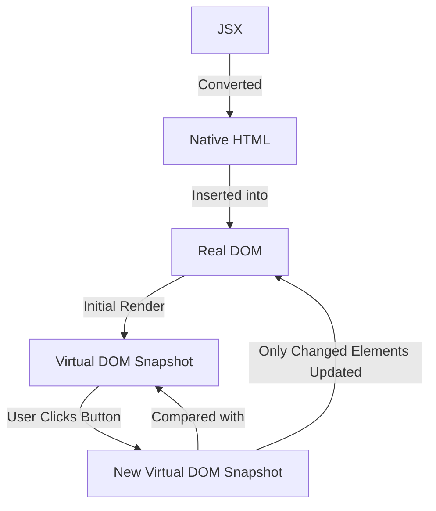

# **JSX to Screen: How React Updates the UI**  

## **From JSX to the DOM**  

React doesn’t insert JSX directly into the DOM. Instead, it **converts JSX into native HTML**, which is then inserted into the **Document Object Model (DOM)**.  

```
JSX → Native HTML → DOM  
```

- The `index.html` file **remains mostly empty**—it just contains a root `<div>` where React injects the app.  
- **Clicking a button doesn’t re-render the entire DOM.** Instead, React **updates only the necessary elements** efficiently.  
- If you inspect the page with Chrome DevTools, you’ll notice that **only specific elements flash**, meaning they were updated.  

### **Example: Counter Component Returning JSX**  
Even though the `Counter` component returns the entire JSX structure:  

```jsx
return (
  <section className="counter">
    <p className="counter-info">
      The initial counter value was <strong>{initialCount}</strong>. It{" "}
      <strong>is {initialCountIsPrime ? "a" : "not a"}</strong> prime number.
    </p>
    <p>
      <IconButton icon={MinusIcon} onClick={handleDecrement}>
        Decrement
      </IconButton>
      <CounterOutput value={counter} />
      <IconButton icon={PlusIcon} onClick={handleIncrement}>
        Increment
      </IconButton>
    </p>
  </section>
);
```
React **does not replace the entire component in the DOM** when `Counter` re-renders. Instead, **only the `<span>` inside `CounterOutput` updates** when the button is clicked.  

---

## **How Does the Virtual DOM Work?**  

React **uses a Virtual DOM** to optimize updates. Instead of modifying the real DOM directly, it:  

1️⃣ Creates a **Virtual DOM snapshot**, a virtual representation of the UI.  
2️⃣ Compares the **new Virtual DOM** with the previous snapshot.  
3️⃣ Identifies **which parts of the UI changed**.  
4️⃣ Updates **only the changed elements** in the real DOM.  

### **🌍 Virtual DOM vs Real DOM (Step-by-Step)**
#### **When the page loads:**
- ✅ React **builds the component tree**.  
- ✅ React **derives the initial HTML structure**.  
- ✅ React **creates a Virtual DOM snapshot** of the initial UI.  
- ✅ React inserts the entire Virtual DOM into the **real DOM** (since there was no previous snapshot).  

---

## **🔄 What Happens on a Button Click?**  

When you click a button, React updates the UI using **diffing and reconciliation**.  

1️⃣ React **rebuilds the component tree**.  
2️⃣ React **creates a new Virtual DOM snapshot** based on the latest state.  
3️⃣ React **compares the new Virtual DOM to the previous one** (diffing).  
4️⃣ React **detects which parts changed** (e.g., the `<span>` inside `CounterOutput`).  
5️⃣ React **updates only the changed elements** in the real DOM.  

🔹 **DOM updates are expensive**, so React minimizes them as much as possible.  
🔹 **The rest of the page remains untouched**, improving performance.  

---

## **🖥️ Visualizing the Process**  



---

## **🔑 Key Takeaways**  

✅ **React doesn’t replace the entire DOM on updates.** It efficiently updates only the necessary elements.  
✅ **The Virtual DOM speeds up UI updates** by minimizing real DOM manipulations.  
✅ **React uses a diffing algorithm** to determine which parts of the UI need to change.  
✅ **Inspecting elements in DevTools shows only updated elements flashing**, proving React’s efficiency.  

